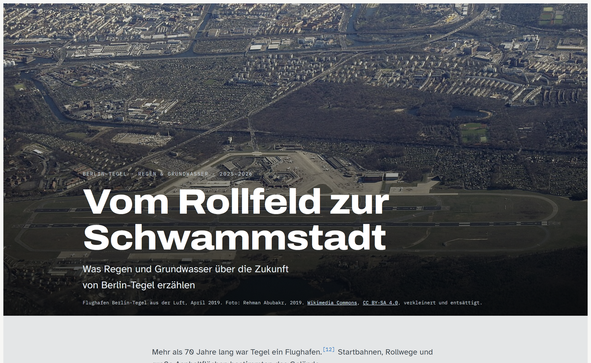
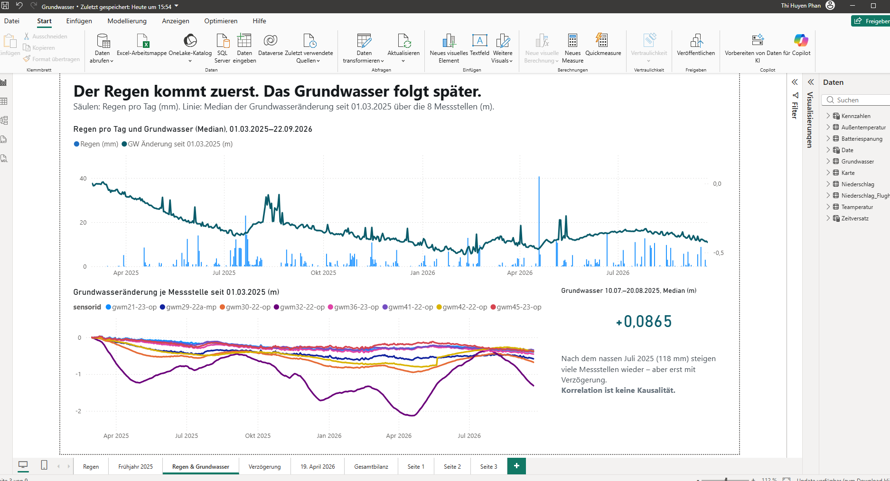
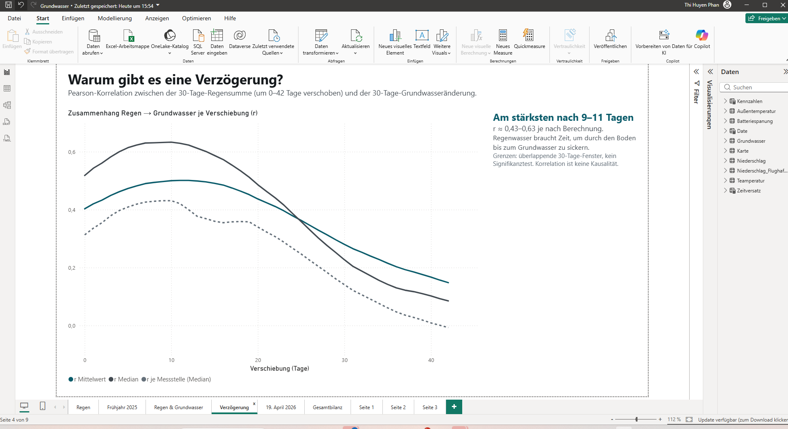
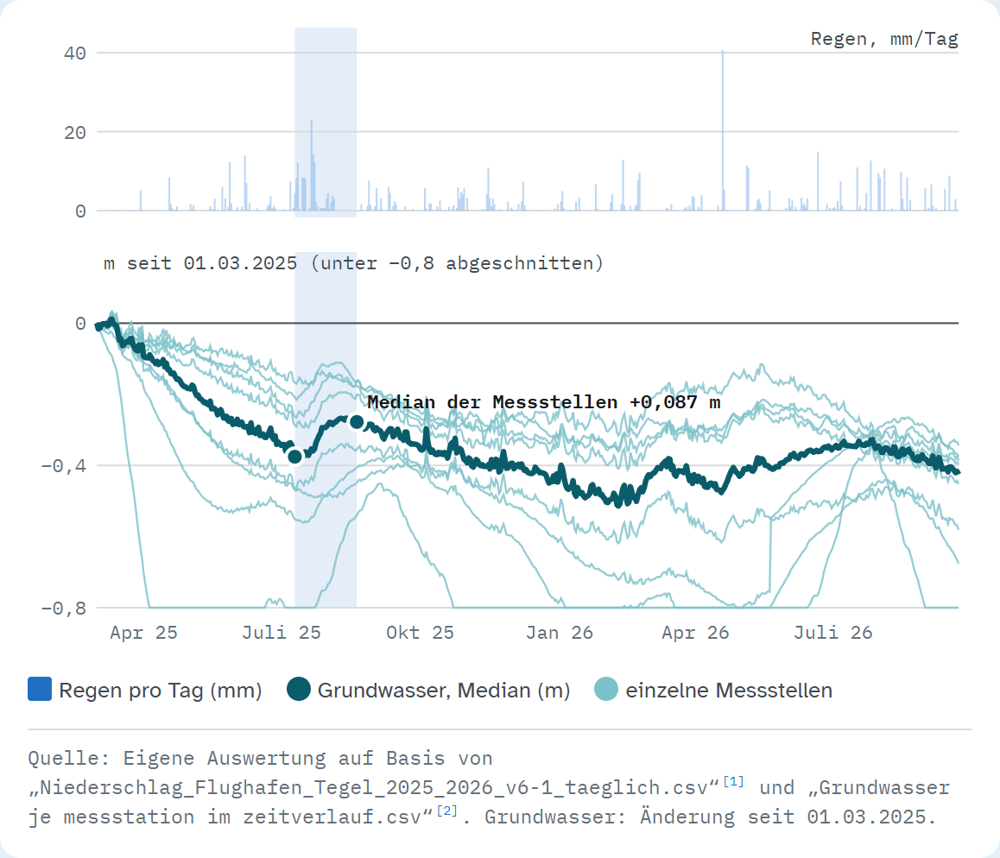

# Vom Rollfeld zur Schwammstadt

**Was Regen und Grundwasser über die Zukunft von Berlin-Tegel erzählen**

Studentisches Projekt im Kurs *Big Data* an der HTW Berlin (2026). Wir haben untersucht, ob und wie das Grundwasser auf dem ehemaligen Flughafengelände Berlin-Tegel auf Niederschlag reagiert. Die Ergebnisse haben wir als Data Story für ein breites Publikum (ab ca. 12 Jahren) aufbereitet.

**Ergebnis ansehen:** **[Website öffnen](https://phanhuyensk9.github.io/TegelGrundwasser-datastory/)** – die Data Story läuft direkt im Browser, ohne Installation. Lokal: [`docs/index.html`](docs/index.html) im Browser öffnen.

[](https://phanhuyensk9.github.io/TegelGrundwasser-datastory/)

**Analyse ansehen:** [`Grundwasser.pbix`](Grundwasser.pbix) mit Power BI Desktop öffnen. Der Bericht enthält die vollständige Auswertung mit allen Diagrammen und Kennzahlen (siehe [Power-BI-Bericht](#power-bi-bericht)).

| Seite „Regen & Grundwasser“ | Seite „Verzögerung“ |
|---|---|
|  |  |

---

## Inhalt

1. [Fragestellung](#fragestellung)
2. [Ergebnisse](#ergebnisse)
3. [Repository-Struktur](#repository-struktur)
4. [Daten](#daten)
5. [Methodik](#methodik)
6. [Power-BI-Bericht](#power-bi-bericht)
7. [Selbst ausführen (Python)](#selbst-ausführen-python)
8. [Weiterarbeiten – Hinweise für Projektpartner](#weiterarbeiten--hinweise-für-projektpartner)
9. [Grenzen der Auswertung](#grenzen-der-auswertung)
10. [Lizenzen und Quellen](#lizenzen-und-quellen)

---

## Fragestellung

> Reagiert das Grundwasser in Tegel auf Regen – und was bedeutet das für die geplante Schwammstadt?

Auf dem 500 ha großen ehemaligen Flughafengelände entstehen die Urban Tech Republic, das Schumacher Quartier und ein Landschaftsraum. Das Schumacher Quartier wird nach dem **Schwammstadt-Prinzip** geplant: Regenwasser soll gespeichert, genutzt, verdunstet und versickert werden, statt schnell abzufließen. Unsere Messdaten aus 2025/2026 beschreiben den Zustand **zu Beginn** dieser Umgestaltung und können als Ausgangslage für spätere Vergleiche dienen.

## Ergebnisse

Analysezeitraum: **01.03.2025 – 22.09.2026**, 8 Grundwassermessstellen, täglicher Niederschlag.

| Befund | Wert | Art |
|---|---|---|
| Niederschlag März + April 2025 | 17,8 mm | Berechnung |
| Niederschlag Juli 2025 | 118,0 mm | Berechnung |
| Stärkster Regentag (19.04.2026) | 40,7 mm | Messwert |
| Grundwasser trockenes Frühjahr (01.03.–30.04.2025), Median | −0,183 m | Statistik |
| Grundwasser nach nassem Juli (10.07.–20.08.2025), Median | +0,0865 m | Statistik |
| Grundwasser nach 19.04.2026 (19.04.–19.06.2026), Median | +0,0705 m | Statistik |
| Grundwasser gesamt (01.03.2025–22.09.2026), Median | −0,425 m | Statistik |
| Schwankungsbreite Messstelle `gwm32-22-op` | 2,13 m | Berechnung |
| Stärkster Zusammenhang Regen → Grundwasser | nach 9–11 Tagen, r ≈ 0,43–0,63 | Statistik |

**Kurz gesagt:**

1. Trockenphasen sind im Grundwasser sichtbar: Im Frühjahr 2025 sinken alle 8 Messstellen.
2. Nach starken Regenphasen steigen viele Messstellen wieder – **zeitversetzt** um etwa ein bis zwei Wochen.
3. Die Reaktion ist von Messstelle zu Messstelle sehr unterschiedlich.
4. Am Ende des Zeitraums liegen alle 8 Messstellen niedriger als zu Beginn. Regen allein erklärt das nicht; auch Verdunstung, Entnahmen, Bebauung und Versiegelung beeinflussen das Grundwasser.

> Korrelation ist keine Kausalität. Die Auswertung zeigt einen statistischen Zusammenhang, keinen Beweis für Ursache und Wirkung.

### Produkt: Scrollytelling-Website

| Interaktive Karte | Scroll-Diagramm |
|---|---|
|  |  |

- 11 Kapitel: erst die Geschichte des Ortes, dann die Daten
- Interaktive Karte (Leaflet + OpenStreetMap-Daten) mit Zeitregler und Verlauf je Messstelle
- Scroll-Diagramm: Trockenphase → Juli-Regen → Grundwasseranstieg
- Bei jeder wichtigen Zahl ein ⓘ „Woher kommt diese Zahl?“ mit Berechnung und Quelle; nummerierte Fußnoten und Quellenverzeichnis
- Für Smartphone und Desktop optimiert

## Repository-Struktur

```
├── data/
│   ├── raw/          Rohdaten, unverändert (CSV)
│   ├── processed/    aufbereitete Daten (CSV, GeoJSON, JSON) – vom Skript erzeugt
│   ├── osm/          OpenStreetMap-Auszug Flughafengelände (GeoJSON)
│   └── README.md     Datenbeschreibung (Spalten, Einheiten, Lizenzen)
├── src/
│   ├── build_tegel.py      Auswertung + Export + Website-Build
│   └── web/                Vorlage der Website (HTML/CSS/JS) und Leaflet-CSS
├── docs/             fertige Website (GitHub Pages)
│   ├── index.html                     Website, Fotos aus docs/img/
│   ├── tegel-datastory-einzeldatei.html  eine Datei, Fotos online
│   ├── img/                           Fotos (Wikimedia Commons)
│   └── screenshots/                   Screenshots für diese README (Website und Power BI)
├── Grundwasser.pbix  Power-BI-Bericht mit denselben Auswertungen
├── requirements.txt
└── LICENSE
```

## Daten

| Datei | Inhalt | Quelle |
|---|---|---|
| `data/raw/Grundwasser je messstation im zeitverlauf.csv` | Tägliche Grundwasserstände (m) von 10 Messstellen | FUTR HUB, Urban Tech Republic |
| `data/raw/Karte mit Grundwasserpegel.csv` | Koordinaten (WGS 84) und Pegel von 8 Messstellen | FUTR HUB, Urban Tech Republic |
| `data/raw/Niederschlag_Flughafen_Tegel_2025_2026_v6-1_taeglich.csv` | Täglicher Niederschlag (mm), Rasterpunkt Tegel | DWD, HYRAS-DE-PR, Version v6-1 |
| `data/osm/tegel_osm.geojson` | Flughafenumriss, Bahnen, Terminal, Gewässer, Autobahnen | © OpenStreetMap contributors (ODbL) |

Alle aufbereiteten Dateien in `data/processed/` sind UTF-8, Komma-getrennt, Dezimalpunkt, Datum im Format ISO 8601 (`YYYY-MM-DD`), Koordinaten in WGS 84 (EPSG:4326). Spaltenbeschreibung: [`data/README.md`](data/README.md).

**Warum HYRAS statt Wetterstation?** Die Daten der DWD-Station Berlin-Tegel lagen uns nur bis 2021 vor und decken den Analysezeitraum nicht ab. Wir haben deshalb den HYRAS-Rasterdatensatz (1 × 1 km, täglich) verwendet und den Rasterpunkt über Tegel ausgelesen. Die ursprüngliche Rohdatei enthielt für 01.01.2025–03.01.2026 zwei Versionen (v6.0 und v6-1, an 31 Tagen abweichend); verwendet wird konsequent **v6-1**.

## Methodik

- **Messstellen:** die 8 Messstellen aus `Karte mit Grundwasserpegel.csv`. Die Zeitreihe enthält zwei weitere Reihen (`gwm1-16`, `gwm5-95`) ohne Koordinaten; sie wurden nicht verwendet.
- **Änderung je Zeitraum:** je Messstelle letzter minus erster verfügbarer Tageswert, in Metern. Zusammengefasst wird mit dem **Median** der 8 Messstellen, damit die stark schwankende Messstelle `gwm32-22-op` das Ergebnis nicht dominiert.
- **Zeitversetzte Korrelation:** Pearson-Korrelation zwischen der 30-Tage-Regensumme und der 30-Tage-Grundwasseränderung. Die Regensumme wird um 0–42 Tage verschoben (`r30.shift(lag)`). Drei Varianten: Mittelwert der Messstellen, Median der Messstellen, je Messstelle einzeln (danach Median). Messlücken bis 5 Tage werden linear interpoliert. Ergebnis: `data/processed/korrelation_regen_grundwasser_verschiebung.csv`.
- **Qualitätsprüfung:** `build_tegel.py` vergleicht 13 im Text genannte Zahlen mit den neu berechneten Werten und meldet Abweichungen.

## Power-BI-Bericht

`Grundwasser.pbix` enthält die Auswertung als interaktiven Bericht mit den Seiten *Regen*, *Frühjahr 2025*, *Regen & Grundwasser*, *Verzögerung*, *19. April 2026* und *Gesamtbilanz*. Die Kennzahlen (Regensummen, Grundwasser-Mediane, zeitversetzte Korrelation) werden im Bericht selbst aus den Rohdaten berechnet – Python ist dafür nicht nötig.

Voraussetzung: [Power BI Desktop](https://www.microsoft.com/de-de/power-platform/products/power-bi/desktop) (kostenlos, nur Windows).

**Bericht mit neuen Daten aktualisieren:**

1. Die neuen CSV-Dateien in `data/raw/` ablegen. Dateinamen und Spaltenaufbau müssen gleich bleiben (siehe [`data/README.md`](data/README.md)).
2. `Grundwasser.pbix` mit Power BI Desktop öffnen.
3. *Start → Aktualisieren* klicken. Power BI liest die CSV-Dateien neu ein und berechnet alle Diagramme und Kennzahlen neu – man erhält so die neue Bewertung.
4. Bericht speichern (*Datei → Speichern*).

**Falls eine Datei nicht gefunden wird** (z. B. weil das Repository an einem anderen Ort liegt): *Start → Daten transformieren → Datenquelleneinstellungen* öffnen, die betroffene Quelle auswählen, *Quelle ändern…* klicken und den Pfad auf die Datei in `data/raw/` setzen. Danach *Schließen & übernehmen* und erneut *Aktualisieren*.

> Die Kennzahlen für feste Zeiträume (z. B. „trockenes Frühjahr 2025“, „nach nassem Juli 2025“) bleiben gleich, solange sich die alten Messwerte nicht ändern. Neue Daten wirken sich vor allem auf die Gesamtbilanz, die Zeitreihen und die Korrelation aus.

## Selbst ausführen (Python)

Voraussetzung: Python ≥ 3.10.

```bash
pip install -r requirements.txt
python src/build_tegel.py
```

Das Skript liest `data/raw/`, prüft die Kennzahlen, schreibt `data/processed/` und erzeugt `docs/index.html`. Die Website läuft ohne Server: `docs/index.html` im Browser öffnen (Internet nötig für Schriften und die Kartenbibliothek Leaflet).

### Website veröffentlichen

Auf GitHub: *Settings → Pages → Branch `main`, Ordner `/docs`*. Danach ist die Website unter [https://phanhuyensk9.github.io/TegelGrundwasser-datastory/](https://phanhuyensk9.github.io/TegelGrundwasser-datastory/) erreichbar.

## Weiterarbeiten – Hinweise für Projektpartner

Für die **Tegeler Stadtheide** und das **CityLAB Berlin**:

- **Neue Messdaten einspielen:** neue CSV-Dateien mit gleichem Aufbau in `data/raw/` ablegen, dann
  1. **Power BI:** `Grundwasser.pbix` in Power BI Desktop öffnen und *Start → Aktualisieren* klicken (siehe [Power-BI-Bericht](#power-bi-bericht)).
  2. **Python (Website):** Zeitraum in `src/build_tegel.py` (`START`, `END`) anpassen und das Skript ausführen (siehe [Selbst ausführen (Python)](#selbst-ausführen-python)). Das Skript meldet, welche Zahlen im Text sich geändert haben.
- **Daten direkt nutzen:** `data/processed/` enthält alles in offenen Standardformaten – für Excel/LibreOffice (CSV), QGIS/uMap/Kepler.gl (GeoJSON) oder Python/R.
- **Karte weiterverwenden:** `data/processed/messstellen.geojson` lässt sich direkt in QGIS oder [uMap](https://umap.openstreetmap.de/) laden.
- **Website anpassen:** Texte und Diagramme stehen in `src/web/template.html` (HTML, CSS, JavaScript ohne Build-Werkzeuge). Nach Änderungen `python src/build_tegel.py` ausführen.
- **Ideen für die Fortsetzung:**
  - Messungen über mehrere Jahre weiterführen, um Effekte der Bebauung und der Schwammstadt-Maßnahmen zu erkennen.
  - Weitere Einflussgrößen einbeziehen: Bodenbeschaffenheit, Verdunstung, Temperatur, Versickerung, Grundwasserentnahmen.
  - Vergleichsgebiet ohne Umbau heranziehen.
  - Anbindung an eine offene Datenplattform (z. B. per API), damit die Seite automatisch aktualisiert wird.

**Zentrale Frage für die Zukunft:** Wie kann Regenwasser in Tegel so genutzt und gespeichert werden, dass es sowohl bei Starkregen als auch in trockenen Zeiten zu einem möglichst ausgeglichenen Wasserhaushalt beiträgt?

## Grenzen der Auswertung

- Rund 1,5 Jahre Daten – für langfristige Trends zu kurz.
- Niederschlag aus einem Rasterdatensatz, nicht direkt am Gelände gemessen.
- Die zeitversetzte Korrelation nutzt überlappende 30-Tage-Fenster; es wurde kein Signifikanztest durchgeführt.
- Andere Einflüsse (Verdunstung, Entnahmen, Baumaßnahmen) sind nicht herausgerechnet.
- Warum einzelne Messstellen (z. B. `gwm32-22-op`) besonders stark schwanken, lässt sich aus den Daten allein nicht erklären.

## Lizenzen und Quellen

| Bestandteil | Lizenz |
|---|---|
| Code (`src/`) | [MIT](LICENSE) |
| Texte, aufbereitete Daten (`data/processed/`) | [CC BY 4.0](https://creativecommons.org/licenses/by/4.0/deed.de) |
| Niederschlag (HYRAS) | DWD, frei nutzbar mit Quellenangabe ([GeoNutzV](https://www.gesetze-im-internet.de/geonutzv/)) |
| Grundwasserdaten | FUTR HUB, Urban Tech Republic – Nutzungsbedingungen beim Datengeber |
| Kartendaten | © [OpenStreetMap contributors](https://www.openstreetmap.org/copyright), ODbL |
| Fotos (`docs/img/`) | Wikimedia Commons, CC BY-SA 4.0 bzw. CC BY 2.0 – Urheber siehe Bildnachweis auf der Website |
| Leaflet | BSD-2-Clause |

**Wichtige Quellen** (abgerufen 23.09.2026):

- Deutscher Wetterdienst: [HYRAS-DE-PR](https://www.dwd.de/DE/leistungen/hyras_de_pr/hyras_de_pr.html)
- FUTR HUB – Innovating Urban Data: [futr-hub.urbantechrepublic.de](https://futr-hub.urbantechrepublic.de/)
- Berlin TXL Management GmbH: [Über uns](https://tegelprojekt.de/ueber-uns/)
- Senatsverwaltung für Stadtentwicklung, Bauen und Wohnen: [Startschuss für Wohnungsbau im Schumacher Quartier](https://www.berlin.de/sen/stadt/presse/pressemeldungen/pressemitteilung.1526943.php), 31.01.2025
- Schumacher Quartier: [Wassernutzung](https://schumacher-quartier.de/wassernutzung/)
- Das vollständige Quellenverzeichnis steht am Ende der Website.

---

*Team: Data in Motion, HTW Berlin, Kurs Big Data.*
